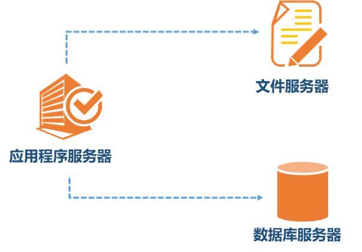

# 系统架构发展

关于大型系统的分布式架构在网上存在着大量的相关资料，在不同的技术栈中又存在这些许的差异，但究其根本整体的思路是大同小异的。我们就此以.net平台为例，对分布式架构的演化过程做一个简单的梳理。

首先说明以下内容是基于普遍化的通用系统而不是做并行数据库等基础服务，因此在Hadoop、Spark、ZooKeeper、dubbo等我们暂不考虑。

### 1. 一台服务器
最初假设的系统中，我们把应用系统、文件和数据库都放在一台服务器上，一台服务器包打天下。

### 2. 不同服务器
随着业务扩展，一台服务器无法满足性能需求，此时我们考虑将应用系统、数据库、文件分别部署在不同的服务器上，并根据服务器用途不同，配置不同的硬件，达到性能最佳的效果。

### 3. 服务器集群
随着业务扩展，一台应用系统、数据库、文件服务器性能无法承载大量数据处理、高并发用户访问时，必须考虑采用集群方式。
#### 3.1 应用服务器集群+负载均衡服务器集群
* 应用系统服务器作为网站的入口，会承担大量的请求，我们往往通过应用服务器集群来分担请求数。
* 应用服务器前面需要部署负载均衡服务器调度用户请求，根据分发策略将请求分发到多个应用服务器节点。以下为常用的负载均衡技术
    * 硬件的有F5，价格比较贵，
    * 软件的有LVS、Nginx、HAProxy等。

#### 3.2 数据库集群和优化
随着用户量的增加，数据库成为最大的瓶颈，改善数据库性能常用的手段是进行读写分离以及分表，读写分离顾名思义就是将数据库分为读库和写库，通过主备功能实现数据同步。分库分表则分为水平切分和垂直切分，水平切换则是对一个数据库特大的表进行拆分，例如订单、物流信息表等。垂直切分则是根据业务不同来切换，如订单、计税等等不同的主题放在不同的数据库中。这种情况下，关联查询是没有的，通过程序可以比较容易的去解决，还有就是采用分布式事务，来保证数据的一致性。我们这里还有一个做法，一个大的数据表拆分为当前操作表和历史记录表， 当前操作表只保留正在操作的数据，完成后转入历史记录表，这样可以提高当前操作数据的效率。

#### 3.3 文件服务器集群
用户一天天增加，业务量越来越大，产生的文件越来越多。通常情况下，一个目录下的文件建议不能超过1万个，否则对于文件的查找和轮询都会非常慢，会导致整个系统无法正常运行。我们一般是按照"\应用程序名\模块名称\日期"的目录结构组织的，对于文件数目仍旧很大的应用，应该再细分。当单台的文件服务器已经不能满足需求，就需要分布式的文件系统支撑。常用的分布式文件系统有NFS。我们用的是MS的分布式文件系统（DFS），与AD域相关性较大。

#### 3.4 分布式缓存服务器集群
因为应用服务器是集群方式，用户前后两次请求可能访问的不是一台服务器。因此已经不能像以前一样使用状态（Application、Session、Cache、ViewState等），应用系统必须是无状态的（当然了，用的负载均衡具有会话保持的时候，一个用户只会定位到一台服务器）。系统的缓存应该保存在专门的缓存服务器上，如果必须有状态，也应该保存在专门的缓存服务器中。作为第一批吃螃蟹者，我们用了微软的AppFabric作为缓存服务器，因为当时版本很低，问题也不少，后来我们弃用了AppFabric，使用Redis作为缓存服务。现在，AppFabric已经改进了不少，运行在Azure云上，应该是不会存在以前的问题了。

*对于各种政府、单位等不能将系统部署到互联网的部门，并且在各省、市都有对应的分支机构。因为网络专线的价格还是比较高的，至少比互联网的网络带宽低了不少，当然了不差钱的不说啊。这种情况下，一般不采用如上的集中式、集群部署方式，而是采用分布式部署的方式，第一种分布式部署是各分支机构搭建一整套系统，定期（例如每天）进行数据的同步工作，将分支数据汇总到总部、总部的数据下发回各分部；第二种分布式部署方式是各分支部署中间件，但是数据集中在总部。*

### 4. 应用水平拆分+消息队列
随着业务进一步扩展，应用程序变得非常臃肿，这时我们需要将应用程序进行业务拆分，如我们做的综合业务管理系统分为门户、联系处置、业务信息、指标、数据查询分析等业务板块。每个业务板块是一个独立的应用负责相对独立的业务运作。业务板块之间通过消息队列进行通信来实现。数据库也进行相应的拆分，不同的主题放到不同的数据库中。同时，最好搭建静态资源服务器，将公用的css、js、images等都存放到静态资源服务器中。

### 5. NoSQL+搜索引擎服务
对于海量数据的查询，我们使用nosql数据库加上搜索引擎可以达到更好的性能。并不是所有的数据都要放在关系型数据中。常用的NOSQL有mongodb和redis，搜索引擎有lucene，我们使用的Solr、ElasticSearch等基于Lucene内核实现的更易用的搜索引擎。数据量大的话，Solr等也要做成集群。

六、再往下走，系统需要与其他系统进行交互，系统也要给各种前端（例如网站、安卓、IOS）提供服务，这样我们就要在逻辑层之上建设应用服务层，提供对客户端的和对外的SOA服务接口。这样又涉及到DTO、WebService、WCF和WebApi（Rest）等概念。但是最重要的是，SOA方式下，包括前面的MQ方式下，事务一致性无法得到保障的，必须采用一定的机制例如事务补偿机制来确保事务的最终一致性。各个业务板块所在的服务器，在不同时段的压力也不同，为了尽量做到服务器集群内各服务器的压力平摊， 还需要提供更好的机制，记录下每个服务器的压力、资源情况、连接数等等，以便将新的请求转向到压力最小的服务器上。

 

七、业务继续发展，就是CDN，再往下就是搭建几个中心，将系统部署在各个中心，各地用户访问距离他最近的中心，中心间数据保持同步。

八、上面讲了应用系统方面比较多，数据方面也要做许多工作。上面已经介绍了分库分表方式。应用系统做大了，势必有许多的数据资源，尤其是现在大数据这个名词非常火爆的情况下，数据分析和处理是一个系统必须要做的事情。这样做的好处是，将数据的查询、分析等独立出来，不影响正式运行中的系统，另外是通过分析挖掘确实能得到许多意想不到的价值。

这时，主要的工作是搭建数据仓库，然后进行后续的分析和处理。使用ETL/ELT将数据定期从正式环境中导入到数据仓库中，按照不同的主题搭建一个个的数据集市。对于数据量比较小的系统，可以使用关系数据库+多维数据库的方式；对于大型系统，就要使用按列存储、并行数据库等方式了。对于数据的分析可以以报表、KPI、仪表盘驾驶舱等方式提供上层领导决策，也可以使用数据挖掘、机器学习和训练等方式实现价值发现、风险控制等。

 

九、一般情况下，企业是没有那么大的财力和人员去做上述内容的，因此使用云成为企业的一个选择。无论是Azure、阿里云、亚马逊等都会提供一个个的服务。我们就以阿里云为例，ECS提供虚拟服务器、SLB提供负载均衡、RDS提供数据库服务、OSS提供存储服务、DRDS是分布式数据服务、ODSP（现在改名叫MaxCompute）提供大数据的计算服务、RocketMQ提供MQ、OCS提供分布式缓存服务、以及CDN、OTS、ADS等等就不一一列举了。

对了，现在还有Docker这个利器，无论在企业还是云中都可以使用，我们在自己内部使用的Redis、Memcached、RabbitMQ、Solr等都部署在Docker中，确实比较方便。

 

上面说了一大堆，其实架构做的再好，还需要底层来实现。目前流行的语言还是面向对象OO的Java、.net等，也就是说还是用OO的思想和理念去编程。抽象、封装、继承、多态尽管很字面上比较容易理解，但是深入的认识确实需要一定的程序量的积累，面向对象的几大原则和设计模式还是编写出更高可扩展、可替换、可配置、可维护等软件质量指标的代码的重要保证。