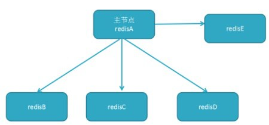
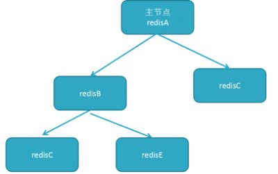
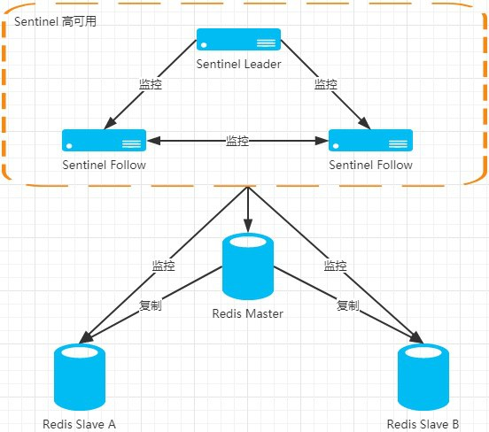
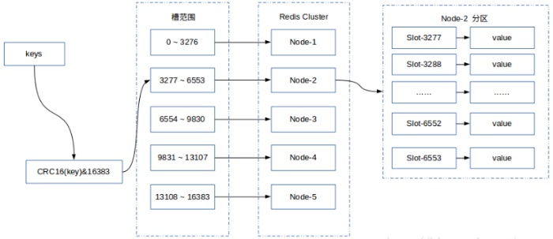
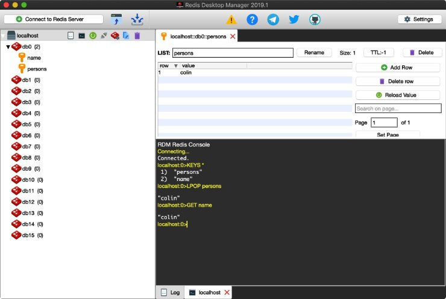
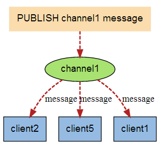

# Redis

## 1. Redis 简介
Redis 是一个支持数据结构更多的键值对数据库。它的值不仅可以是字符串等基本数据 类型,也可以是类对象,更可以是 Set、List、计数器等高级的数据结构。

Memcached 也可以保存类似于 Set、List 这样的结构,但是如果说要向 List 中增加元素, Memcached 则需要把 List 全部元素取出来,然后再把元素增加进去,然后再保存回去,不仅效率低,而且有并发访问问题。Redis 内置的 Set、List 等可以直接支持增加、删除元素的 操作,效率很高,操作是原子的。

Memcached 数据存在内存中,memcached 重启后数据就消失;而 Redis 会把数据持久化到硬盘中,Redis 重启后数据还存在。

1) 优点
* 支持 string、list、set、geo 等复杂的数据结构。
* 高命中的数据运行时是在内存中,数据最终还是可以保存到磁盘中,这样服务器重 启之后数据还在。
* 服务器是单线程的,来自所有客户端的所有命令都是串行执行的,因此不用担心并 发修改(串行操作当然还是有并发问题)的问题,编程模型简单;
* 支持消息订阅/通知机制,可以用作消息队列;
* Key、Value 最大长度允许 512M;

2) 缺点
* Redis 是单线程的,因此单个 Redis 实例只能使用一个 CPU 核,不能充分发挥服务器的性能。可以在一台服务器上运行多个 Redis 实例,不同实例监听不同端口,再互相组成集群。
* 做缓存性能不如 Memcached;

Redis高级教程参阅 [https://blog.csdn.net/hjm4702192/article/details/80518856](https://blog.csdn.net/hjm4702192/article/details/80518856)

## 2. Redis 环境搭建
### 2.1 单节点
推荐使用Docker方式搭建redis服务器，简单高效。
```sh
docker run \
-d \
--name redis \
-p 6379:6379 \
redis:alpine \
--requirepass "password"
```

Redis客户端有其命令行，也有第三方GUI客户端。比较流行有是开源跨平台的[RedisDesktopManager](https://github.com/uglide/RedisDesktopManager)。

> redis标准配置文件 [http://download.redis.io/redis-stable/redis.conf](http://download.redis.io/redis-stable/redis.conf)

### 2.2 主从架构

Redis可以配置`master-slave`模式来实现读写分离，数据备份和故障转移等功能。一般master节点用于写数据，而数据读取可以直接访问slave节点，slave节点数据默认只读。



master节点可以配置多slave节点，master的slave节点太多会增加主从同步资源开销,可以使用下面的拓扑结构减轻主节点推送的压力。



下面是一个“一主二从”的docker-compose示例。
```yml
version: '3.7'

services:
  redis-master:
    image: redis:alpine
    container_name: redis-master
    command: redis-server --requirepass master_password
    ports: 
      - "6379:6379"
    restart: always

  redis-slave1:
    image: redis:alpine
    container_name: redis-slave1
    command: redis-server --slaveof redis-master 6379 --masterauth master_password --port 6380 --requirepass slave_password
    ports: 
      - "6380:6380"
    restart: always
    depends_on:
      - redis-master

  redis-slave2:
    image: redis:alpine
    container_name: redis-slave2
    command: redis-server --slaveof redis-master 6379 --masterauth master_password --port 6381 --requirepass slave_password
    ports: 
      - "6381:6381"
    restart: always
    depends_on:
      - redis-master
```

主从结构中只需要修改slave节点配置文件，添加`slaveof`参数绑定主节点即可。或者我们可以使用docker-compose来快速搭建一个主从结构的Reids环境。

主从架构中如果master节点出现故障，需要人工选择和修改slave节点配置升级其为新的master节点，无法实现高可用性。高可用(主从复制、主从切换)redis集群有两种方案，一种是redis-sentinel，只有一个master，各实例数据保持一致；一种是redis-cluster，也叫分布式redis集群，可以有多个master，数据分片分布在这些master上。

### 2.3 redis-sentinel

哨兵机制(sentinel)可以在主节点出现故障时，由Redis Sentinel自动完成故障发现和转移，并通知应用方，实现高可用性。

redis-sentinel作为独立的服务，用于管理多个redis实例，该系统主要执行以下四个任务：
* 监控 (Monitor): 检查redis主、从实例是否正常运作
* 通知 (Notification): 监控的redis服务出现问题时，可通过API发送通知告警
* 自动故障迁移 (Automatic Failover): 当检测到redis主库不能正常工作时，redis-sentinel会开始做自动故障判断、迁移等操作，先是移除失效redis主服务，然后将其中一个从服务器升级为新的主服务器，并让失效主服务器的其他从服务器改为复制新的主服务器。当客户端试图连接失效的主服务器时，集群也会向客户端返回最新主服务器的地址，使得集群可以使用新的主服务器来代替失效服务器
* 配置中心。sentinel启动时指定了mater节点，并可自动发现和动态更新slave节点。它可为应用程序提供集群中所有节点信息。

我们只需要配置master节点即可，Sentinel会自动发现slave节点并动态更新配置。

Redis至少使用三个Sentinel节点。sentinel.conf简单配置如下。
```conf
port 26379

# bind to master node.the 'redis-service' is an alias.
# redis-master 6379 is the address of master node
# The quorum was set to the value of 2 (last argument of sentinel monitor configuration directive).
sentinel monitor redis-service redis-master 6379 2

# down-after-milliseconds value is 5000 milliseconds, that is 5 seconds, so masters will be detected as failing as soon as we don't receive any reply from our pings within this amount of time.
sentinel down-after-milliseconds redis-service 5000

sentinel failover-timeout redis-service 60000
sentinel parallel-syncs redis-service 1

sentinel auth-pass redis-service master_password
```



* Docker方式搭建推荐使用 [grokzen/redis-cluster](https://hub.docker.com/r/grokzen/redis-cluster)镜像。
* 应用程序与redis-sentinel集群交互示例参阅 [https://colin-chang.site/python/database/redis.html#_2-1-redis-sentinel](https://colin-chang.site/python/database/redis.html#_2-1-redis-sentinel)

> 参考资料
* Sentinel官方文档: [https://redis.io/topics/sentinel](https://redis.io/topics/sentinel)
* 标准配置文件: [http://download.redis.io/redis-stable/sentinel.conf](http://download.redis.io/redis-stable/sentinel.conf)
* [https://www.cnblogs.com/hckblogs/p/11186311.html](https://www.cnblogs.com/hckblogs/p/11186311.html)
* [https://blog.51cto.com/8939110/2429771](https://blog.51cto.com/8939110/2429771)

### 2.4 redis-cluster
Redis3.0版本之前，可以通过Redis Sentinel来实现高可用，从3.0版本之后，官方推出了Redis Cluster，它的主要用途是实现数据分片(Data Sharding)，同样可以实现高可用，是官方当前推荐的方案。
·
redis cluster在设计的时候，就考虑到了去中⼼化，去中间件，集群中的每个节点都是平等的，每个节点都保存各⾃的数据和整个集群的状态。每个节点都和其他所有节点连接，⽽且这些连接保持活跃，保证只需要连接集群中任意节点，都可获取到其他节点的数据。



在Redis Sentinel模式中，每个节点需要保存全量数据，冗余比较多，而在Redis Cluster模式中，每个分片只需要保存一部分的数据。 Redis Cluster的具体实现细节是采用了Hash槽的概念，集群会预先分配16384个槽，并将这些槽分配给具体的服务节点，通过对Key进行CRC16(key)%16384运算得到对应的槽是哪一个，从而将读写操作转发到该槽所对应的服务节点。当有新的节点加入或者移除的时候，再来迁移这些槽以及其对应的数据。在这种设计之下，我们就可以很方便的进行动态扩容或缩容。

Redis Cluster同样采用Master-Salve模式，写数据在master节点，它会与其对应的salve进⾏数据同步。当读取数据时，也根据⼀致性哈希算法到对应的master节点获取数据。当⼀个master挂掉之后，会自动切换其对应salve节点为新master节点。

**redis-cluster要求至少3个主节点(否则在创建集群时会失败)**，并且当存活的主节点数⼩于总节点数的⼀半时，整个集群就⽆法提供服务了。

* Docker方式搭建推荐使用 [grokzen/redis-cluster](https://hub.docker.com/r/grokzen/redis-cluster)镜像。
* 物理机搭建教程参阅 [https://www.cnblogs.com/wuxl360/p/5920330.html](https://www.cnblogs.com/wuxl360/p/5920330.html)
* 应用程序与redis-cluster交互示例参阅 [https://colin-chang.site/python/database/redis.html#_2-2-redis-cluster](https://colin-chang.site/python/database/redis.html#_2-2-redis-cluster)

> 参考资料 [官方文档](https://redis.io/topics/cluster-tutorial/)

## 3. Redis 数据类型
在安装Redis时会同时安装服务端和客户端。服务端为`redis-server`客户端为`redis-cli`。使用客户端连接Redis服务之后可以在shell中执行Redis命令。

```sh
# 连接本地redis服务
redis-cli -p 6379 -a password

keys * # get all keys
set name Colin # set a string value
get name # get a string value of name
```

除了使用Redis提供的命令行客户端，我们也可以使用第三方GUI客户端，如[Redis Desktop Manager](https://github.com/uglide/RedisDesktopManager/)等。一般客户端软件也提供了Redis命令行。



Redis按不同数据类型提供了对应的操作命令，[Python平台的redis driver](https://colin-chang.site/python/database/redis.html)与Redis原生命令基本相同，需要了解的读者可以参考，这里不在列举Redis命令。

下面我们以.Net Core平台为例进行讲解，Python平台请参阅[https://colin-chang.site/python/database/redis.html](https://colin-chang.site/python/database/redis.html)

### 3.1 基础知识

* 不同系统放到 Redis 中的数据是不隔离的,因此设定 Key 的时候也要特别注意。
* Redis 服务器默认建了 16 个数据库,Redis 的想法是让大家把不同系统的数据放到不同的数据库中。但是建议大家不要这样用,因为 Redis 是单线程的,不同业务都放到同一个 Redis 实例的话效率不高,建议放到不同的实例中。因此尽量只用默认的 db0 数据库。
* Redis 支持的数据结构有 string、list、set、sortedset、hash、geo(redis 3.2 以上版本)。对应的 Redis 客户端里的方法都是 StringXXX、HashXXX、GeoXXX 等方法。不同数据类型的操作方 法不能混用,比如不能用 ListXXX 写入的值用 StringXXX 去读取或者写入等操作。
* Redis的所有数据类型本质上最终存储的都是String类型，Set等高级类型只是使用不同数据结构管理String类型。所以Redis中并不能存储复杂对象，但可序列化后存储。

### 3.2 Redis Driver for .Net
.NET Core平台下，ServiceStack.Redis 是商业版，免费版有限制。StackExchange.Redis 2.0之前版本有超时问题，现已解决。除了这两个传统的库之外，国内大牛也开了一些优秀的高性能.Net Core的Redis组件，供我们选择。

* [NewLife.Redis](http://git.newlifex.com/NewLife/NewLife.Redis) 他是NewLife团队开发的，已经在ZTO大数据实时计算中广泛应用，200多个Redis实例稳定工作一年多，每天处理近1亿包裹数据，日均调用量80亿次。
* [CSRedis](https://github.com/2881099/csredis) (这里我更喜欢把它叫做CSRedisCore)这是另一个国内大牛nicye 开发的，为人很低调，所以了解他的人很少！目前我项目中广泛使用的也是这个。作者前不久刚做了一个几大Redis组件的性能测试.net core 2.0 redis驱动性能比拼 有兴趣的可以打开链接看一下。

详细对比和使用方式可参阅以下文档：
* https://www.cnblogs.com/yilezhu/p/9947905.html
* https://www.cnblogs.com/yilezhu/p/9941208.html

下面我们以使用最广泛的[StackExchange.Redis](https://stackexchange.github.io/StackExchange.Redis/)为例讲解。


### 3.3 连接Redis

```csharp
var redis = ConnectionMultiplexer.Connect("localhost:6379");//官方推荐重用Redis连接而不是每次用完释放
IDatabase db = redis.GetDatabase();//默认访问 db0 数据库,可以指定数字访问不同的数据库
```

* 支持设置过期时间:`db.StringSet("key", "value", TimeSpan.FromSeconds(10))`
* 获取数据:`string s = db.StringGet("key")`如果查不到则返回 null
* 参数、返回值 `RedisKey`、`RedisValue` 类型,进行了运算符重载,可以和 `string`、 `byte[]`之间进行隐式转换。

### 3.4 Key操作
Redis 里所有数据类型都是用 Key-Value 保存,因此 **Key 操作是针对所有数据类型**。

方法|作用
:-|:-
`KeyDelete(RedisKey key)`|根据 Key 删除;
`KeyExists(RedisKey key)`|判断 Key 是否存在,存在并发问题;
`KeyExpire(RedisKey key, TimeSpan? expiry)`|设置过期时间

### 3.5 String
方法|作用
:-|:-
db.StringAppend(RedisKey key, RedisValue value)|附加内容,不存在则新建;
db.StringIncrement("count", 2.5)|计数器加值
db.StringDecrement("count",1)|计数器减值

计数器不存在则从0开始计，可以以此来计算新闻点击量、点赞量,非常高效。

### 3.6 List
Redis 中 List是双向链表，长度是无限，左右都可出入元素。可以当成双向队列或者双向栈用,比如可以把聊天记录、商品的物流信息等保存到 List 中。

方法|作用
:-|:-
ListLeftPush(RedisKey key, RedisValue value)|从左侧压栈
RedisValue ListLeftPop(RedisKey key)|从左侧弹出
ListRightPush(RedisKey key, RedisValue value)|从右侧压栈
RedisValue ListRightPop(RedisKey key)|从右侧弹出
RedisValue ListGetByIndex(RedisKey key, long index)|获取 List 中第 index 个元素的值
long ListLength(RedisKey key)|获取List 中元素个数
RedisValue[] ListRange(RedisKey key, long start = 0, long stop = -1)|读但不取出元素

*ListGetByIndex,ListLength 会有并发问题*

左进左出或右进右出则可作为栈使用，左进右出或右进左出则可作为队列使用。可以使用Redis的List用作轻量的消息队列使用。

### 3.7 Set
Set 是一个元素去重的集合。如使用 Set 保存禁用用户 id 等,就不用做重复性判断了。

注意 Set 不是按照插入顺序遍历的,而是按照自己的一个存储方式来遍历。

方法|作用
:-|:-
bool SetAdd(RedisKey key, RedisValue value)|向 Set 中增加元素，如果已存在则返回false
bool SetContains(RedisKey key, RedisValue value)|判断 Set 中是否存在某个元素
long SetLength(RedisKey key)|获得 Set 中元素的个数
SetRemove(RedisKey key, RedisValue value)|从 Set 中删除元素
RedisValue[] SetMembers(RedisKey key)|获取集合中的元素

*SetContains,SetLength 会有并发问题*

### 3.8 SortedSet
与Set相比SortedSet除了key,value外还提供了一个score字段记录数据记录的“分数”。如果对于数据遍历顺序有要求,可以使用 SortedSet,它会按照分数来进行遍历。**SortedSet也称 ZSet**。

方法|作用
:-|:-
SortedSetAdd(RedisKey key, RedisValue member, double score)|添加数据记录和分数,如果存在则覆盖
double SortedSetIncrement(RedisKey key, RedisValue member, double value)| 增加分数
double SortedSetDecrement(RedisKey key, RedisValue member, double value)|减少分数
SortedSetEntry[] SortedSetRangeByRankWithScores(RedisKey key, long start = 0, long stop = -1, Order order = Order.Ascending)|根据排序返回元素以及元素的分数。start、stop 用来分页查询、order 指定排序规则。
RedisValue[] SortedSetRangeByRank(RedisKey key, long start = 0, long stop = -1, Order order = Order.Ascending)|根据排序返回，如返回TOP10元素
RedisValue[] SortedSetRangeByScore(RedisKey key, double start = double.NegativeInfinity, double stop = double.PositiveInfinity, Exclude exclude = Exclude.None, Order order = Order.Ascending, long skip = 0, long take = -1)|根据分数返回。如返回大于90分的元素

::: tip 应用场景
* 热搜榜。每搜一次一个关键词,就给这个关键词加一分，最后提取 TOP-N 即可
* 热门商品
* 积分投票
:::

### 3.9 Hash
Hash的value 是一个“键值对集合”或者值是另外一个 Dictionary。可以用于存储对象，类似于Json方式存储对象。

### 3.10 Geo
Geo 是 Redis 3.2 版本后新增的数据类型,用来保存兴趣点(POI,point of interest)的坐标信息。 可以实现计算两 POI 之间的距离、获取一个点周边指定距离的 POI。可用于搜索指定地理位置周边的数据，如嘀嘀打车，附近的人等。

## 4. 高级操作
### 4.1 批量操作
频繁操作会影响Redis性能,我们可以使用批量操作来较少请求次数。
* 1) 数组操作
    几乎所有操作都支持数组类型,这样就可以一次性操作多条数据,如SortedSetAdd(RedisKey key, SortedSetEntry[] values)
* 2) 批量模式
```csharp
IBatch batch = db.CreateBatch();
db.StringSet("abc", "123");
db.GeoAdd("ShopsGeo1", new GeoEntry(116.34039, 39.94218, "1"));
batch.Execute();
```
CreateBatch()、Execute()之间的操作会一次性提交给Redis服务器。

### 4.2 发布订阅
Redis 发布订阅(pub/sub)是一种消息通信模式：发送者(pub)发送消息，订阅者(sub)接收消息。Redis 客户端可以订阅任意数量的频道。



```csharp
//发布
var pub = ConnectionMultiplexer.Connect(connectionString).GetSubscriber();
await pub.PublishAsync("channel1","message content");
```
```csharp
//订阅
var pub = ConnectionMultiplexer.Connect(connectionString).GetSubscriber();
await pub.SubscribeAsync("channle1", (chn, msg) => Console.WriteLine(msg));
```
发布订阅和List作队列使用，分别实现了发布订阅模式和生产者消费者模式，可以作轻量级消息队列使用，处理并发和解除应用间耦合关系等。

### 4.3 分布式锁
多线程中的 lock 等的作用范围是当前的程序范围内的,如果想跨多台服务器的锁(尽量避免这样搞),就要使用分布式锁，如作秒杀活动等。

分布式锁一般有三种实现方式：
* 数据库乐观锁
* 基于Redis的分布式锁
* 基于ZooKeeper的分布式锁

这里我们主要介绍基于Redis的分布式锁。

```csharp
/// <summary>
/// 获取分布式锁并执行
/// </summary>
/// <param name="action">获取锁成功时执行的业务方法</param>
/// <param name="key">要锁定的key。用相同且唯一的key来当竞争对象,即要锁的对象</param>
/// <param name="value">给value赋值是为了明确锁是哪个请求加的,解锁时也必须是具有相同value的请求才能解锁，保证不会被其他请求解锁。</param>
/// <param name="expiryMillisecond">超时时间</param>
/// <returns>竞争锁是否成功</returns>
public async Task<bool> LockExecuteAsync(Action action, string key, string value,
    int expiryMillisecond = 3000)
{
    //竞争锁
    if (!await Db.LockTakeAsync(key, value, TimeSpan.FromMilliseconds(expiryMillisecond)))
        return false;

    try
    {
        //获取锁后执行业务方法
        action();
        return true;
    }
    finally
    {
        Db.LockRelease(key, value);//解锁
    }
}
```

```csharp
var guid = Guid.NewGuid().ToString();
Redis.LockExecuteAsync(()=>Console.WriteLine("成功抢到锁"),"lockKey",guid);
```

## 5. RedisHelper
Redis的大部分常用操作都是相同的，这里我们基于`StackExchange.Redis`和`.Net Standard 2.0`封装一个帮助类。

* 包含String,List,Set,SortedSet,Hash等常用数据类型操作。
* 支持发布订阅
* 支持批量执行
* 支持分布式锁

代码已上传到Github，这里不再展开。
https://github.com/colin-chang/RedisHelper

具体使用方式可以查看单元测试
https://github.com/colin-chang/RedisHelper/blob/master/ColinChang.RedisHelper.Test/RedisHelperTest.cs

> [Nuget - ColinChang.RedisHelper](https://www.nuget.org/packages/ColinChang.RedisHelper/)

```sh
# Package Manager
Install-Package ColinChang.RedisHelper

# .NET CLI
dotnet add package ColinChang.RedisHelper
```